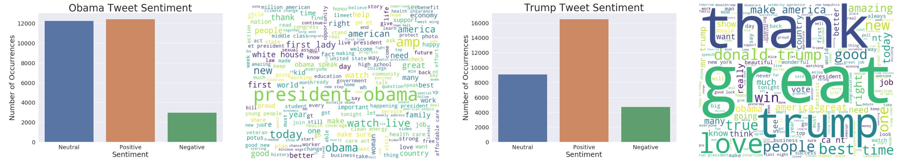

# sentiment-analysis-potus

Using machine learning, we created a sentiment analyzer that determines if tweets carry positive, neutral, or negative sentiment. In addition, we evaluated time series and identify trends for local variations to more accurately assess Trump’s usual twitter sentiment vs Obama’s.

When looking at Trump versus Obama’s tweets, we found that Obama had a more even distribution of positive and neutral sentiment of tweets, while having very little negative sentiment tweets. Trump had a disproportionately higher number of positive sentiment tweets over the other categories.

    

To see the analysis, clone the repository: <br><br>
```git clone https://github.com/miscalculation/sentiment-analysis-potus.git```
    
You will need Python's Jupyter Notebook, which can be installed:<br><br>
```brew install python3```<br>
```pip3 install notebook```

To start the jupyter notebook, route to the local file in the terminal:<br>
```jupyter notebook```


